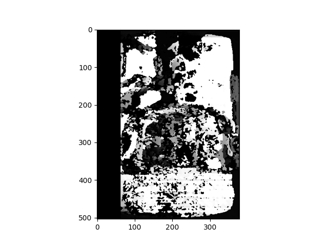
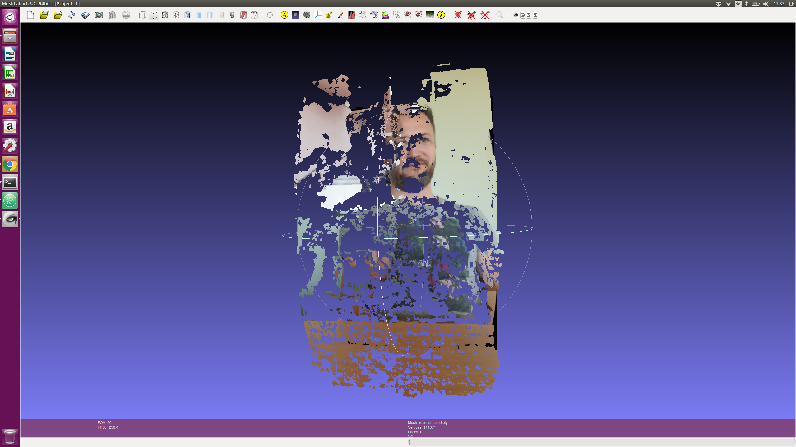
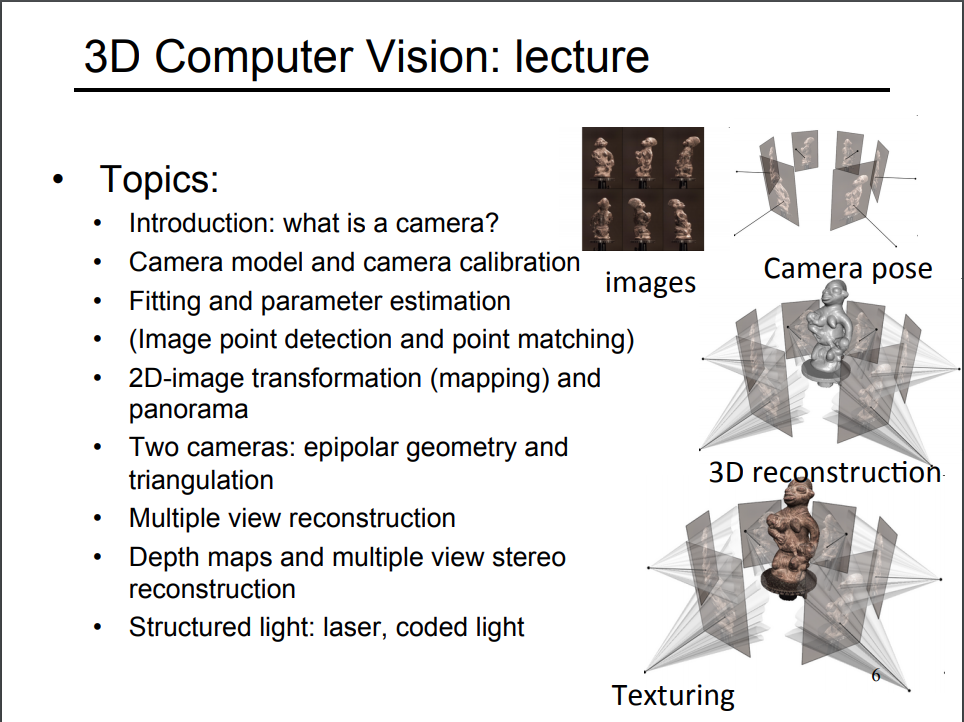

# 3d_reconstruct
Tutorial on using mobile camera to reconstruct 3D based on 2D images.

Following the tutorial [here](https://medium.com/@omar.ps16/stereo-3d-reconstruction-with-opencv-using-an-iphone-camera-part-iii-95460d3eddf0) that again is based on this [openCV tutorial](https://docs.opencv.org/3.4.4/d9/db7/tutorial_py_table_of_contents_calib3d.html).

In the tutorial i first printed out a chessboard pathern and hung on the wall. Then I took alot of images of it using my phone. Then i ran the ```calibrate.py``` that calculates and stores the camera parameters in files for later use.

Then I ran the ```disparity.py``` script on two pictures of my self that I had my girlfriend help me take. I used a table to ensure same height. I also tried to have her focus the camera straight ahead. The disparity map got like this;



The script also returned a pointcloud file. I opened this in Meshlab resulting in this;



[This lecture](https://ags.cs.uni-kl.de/fileadmin/inf_ags/3dcv-ws14-15/3DCV_lec01_camera.pdf) by Prof. Didier Stricker is also relevant to skim through. The following slide present 3D reconstruction in four mayor steps;

1) getting images, 2) getting their poses, 3) 3D reconstruction and 4) Texturing.


